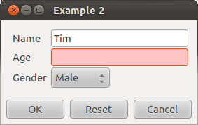
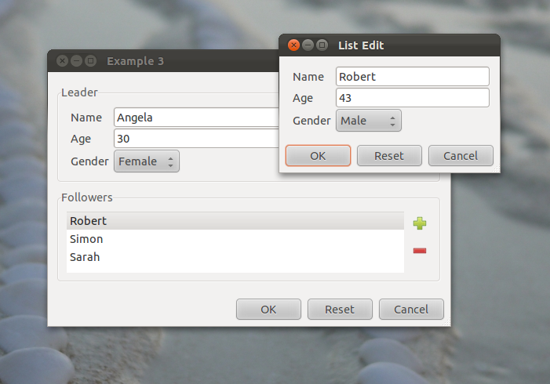

Graphical User Interfaces (GUIs) in haskell are frustrating. It's not
yet clear what is the cleanest model for fitting GUIs into functional
programming. Currently there are two main approaches:

-   Various effort at applying Functional Reactive Programming (FRP) to
    GUIs. These are somewhat experimental, and tend to be proof of
    concepts implementing a small range of GUI features (several of
    these libraries are listed
    [here](http://www.haskell.org/haskellwiki/Applications_and_libraries/GUI_libraries#High-level)).

-   The full blown toolkits which provide a comprehensive imperative
    binding to mainstream toolkits. The two key contenders here are
    [gtk2hs](http://projects.haskell.org/gtk2hs/) and
    [wxHaskell](http://www.haskell.org/haskellwiki/WxHaskell).

Whilst enticing, the FRP approach doesn't currently look appropriate for
building rich GUI applications. wxHaskell and gtk2hs at least provide
the functionality required, but the low level imperative approach based
in the IO monad is tedious to a fluent haskell developer. Here's a code
snippet:

    b <- buttonNew
    image <- imageNewFromStock stockAdd IconSizeSmallToolbar
    containerAdd b image
    set b [buttonRelief := ReliefNone]
    on b buttonActivated {
         ... button activated action ...
    }

It's not hard to write this sort of code, but it is tedious, especially
considering the amount that is required to build a whole application.

This post outlines my experiments to reduce the amount of imperative
code required for GUIs, yet retaining compatibility with the imperative
toolkits. Initially I've been focussed on "value editors" (VEs) aka
"forms". These are GUI components to capture/edit values of ideally
arbitrary complexity. I've two key goals, composability and abstraction.

*Composability*: I want to be able to compose my value editors
effortlessly. Whilst the existing toolkits let you compose widgets using
containers and glue code, it's verbose indeed.

*Abstraction*: I'd like to define my VEs independently from the
underlying toolkit. But I'm looking for something more than a thin layer
over the existing toolkits. I want to define my VEs in terms of the
structure of the values involved, and worry about the formatting and
layout later, if at all.

If we take this abstraction far enough, it should be possible to reuse
our structural VEs definitions beyond gtk2hs and wxWindows. For example,
a JSON generator+parser pair can be considered a VE - in the sense that
to edit a value, one can generate the json text, edit the text, and then
parse to recover the new value. Of course, it's likely to be a balancing
act between abstraction and functionality - we'll have to see how this
pans out.

An Abstract UI
==============

OK, enough preamble, here's a GADT I've devised to capture VEs:

    -- | A GADT describing abstracted, user interface components for manipulating
    -- values of type a.
    data VE a where
        -- | A String field
        Entry :: VE String

        -- | An enumeration. A list of label string are supplied,
        -- the VE value is the integer index of the selected label.
        EnumVE :: [String] -> VE Int

        -- | Annotate a VE with a text label
        Label :: String -> VE a -> VE a

        -- | A "product" VE that combines values from two other VEs
        AndVE :: (VE a) -> (VE b) -> VE (a,b)

        -- | A "sum" VE that captures the value from either of two other VEs
        OrVE  :: (VE a) -> (VE b) -> VE (Either a b)

        -- | A VE for manipulating  a list of values. The supplied function lets the
        -- the VE display the list items to the user (eg for selection).
        ListVE :: (a->String) -> VE a -> VE [a]

        -- | Convert a VE over a type a, to a VE over a type b, given
        -- the necessary mappings. Either String captures the potential
        -- failure in the mapping.
        MapVE :: (a -> Either String b) -> (b -> a) -> VE a -> VE b

        -- | Annotate a VE with a default value
        DefaultVE :: a -> VE a -> VE a

    -- A typeclass to build VEs
    class HasVE a where
      mkVE :: VE a

    (.*.) = AndVE
    (.+.) = OrVE
    infixr 5 .*.
    infixr 5 .+.

And here's an example usage for a simple data type:

    data Gender = Male | Female deriving (Show,Enum)

    data Person = Person {
        st_name :: String,
        st_age :: Int,
        st_gender :: Gender
    } deriving (Show)

    instance HasVE Person
      where
        mkVE = MapVE toStruct fromStruct
            (   Label "Name" nonEmptyString
            .*. Label "Age"   mkVE
            .*. Label "Gender"   mkVE
            )
          where
            toStruct (a,(b,c)) = Right (Person a b c)
            fromStruct (Person a b c) = (a,(b,c))

    nonEmptyString :: VE String
    nonEmptyString = ...

    instance HasVE Int ...
    instance HasVE String ...
    instance HasVE Gender ...

This captures in some sense the abstract semantics for an editor of
Person values. We need to capture:

-   a non-empty string for the name,
-   an integer for the age
-   a gender enumeration

and know how to pack/unpack these into a person value.

A GTK UI
========

But what can we do with this? We need to turn this abstruct VE into a
concrete UI. There's a library function to do this for an arbitrary VE:

    data GTKWidget a = GTKWidget {
        ui_widget :: Widget,
        ui_set :: a -> IO (),
        ui_get :: IO (ErrVal a),
        ui_reset :: IO ()
    }

    uiGTK  :: VE  a -> IO (GTKWidget a)

The uiGTK function turns our abstract VE a into GTK component for
editing a value of type a. In addition to building the compound widget,
it gives us functions to:

-   put a value into the widget
-   recover a value from the widget
-   restore the widget to a default value

A higher level function constructs a modal dialog to get a value of type
a from the user.

    data ModalDialog e a = ModalDialog {
        md_dialog :: Dialog,
        md_gw :: GTKWidget a,
        md_run :: IO (Maybe a)
    }

    modalDialogNew :: String -> VE a -> IO (ModalDialog a)

Hence running this:

    dialog <- modalDialogNew "Example 2" (mkVE :: Person)
    ma <- md_run dialog

Results in this:

The automatically generated dialog is simple, but quite functional:

-   invalid fields have a red background, dynamically updated with each
    keystroke
-   Fields have sensible defaults - often invalid to force entry from a
    user

More complex UIs are of course possible. As should be clear from the VE
GADT above we support sum and product types, lists, etc, and can map
these with arbitrary code. Hence we can construct GTK UIs for a very
large range of haskell values. A slightly more complex example composes
the previous VE:

    data Team = Team {
        t_leader :: Person,
        t_followers :: [Person]
    } deriving (Show)

    instance HasVE Team ...

Resulting in:

Recursive types are supported, so its possible to build GTK VEs for
expression trees, etc.

JSON Serialisation
==================

As I alluded to previously, given VE a, we can automatically generate a
JSON generator and parser for values of type a:

    data VEJSON a = VEJSON {
            uj_tojson ::  a -> DA.Value,
            uj_fromjson :: DA.Value -> Maybe a
    }

    uiJSON :: VE ConstE a -> VEJSON a

Related Work
============

Well into working on these ideas, I was reminded of two somewhat similar
haskell projects: [Functional
Forms](http://www.sandr.dds.nl/FunctionalForms/) and [Tangible
Values](http://www.haskell.org/haskellwiki/TV). Functional Forms aims to
ease the creation of wxHaskell dialogs to edit values. The exact purpose
Tangeable Values is a little unclear to me, but it appears to be about
automatically generating UIs suitable for visualising function behaviour
and exploring functional programming.

Future Work
===========

Currently I have a library that implements the VE GADT to automatically
build GTK editors and JSON serialisers. There's many ways to progress
this work. Some of my ideas follow...

Whilst the generated GTK editor is a sensible default, there are only
very limited ways in which the editor can be customised. I envisage a
model where the uiGTK function takes an extra parameter akin to a style
sheet, given extra information controlling the UI layout and formatting,
etc.

I can envisage many other useful things that could automatically be
derived from VE definitions:

-   equivalent functionality for wxHaskell
-   console GUIs
-   Funky UIs implemented with primitives more interesting than the
    standard toolkit widgets: eg zoomable UIs, or UIs more suited to
    table based platforms.
-   web GUIs. This could be done by automatically generating javascript
    and corresponding server side haskell code.

Finally, It might be worth investigate whether the [GHC
Generic](http://www.haskell.org/haskellwiki/GHC.Generics) mechansism
might be used to automatically generate VE definitions.

So there's plenty of directions this work can go, but right now I want
to put it to the test and build an application!
